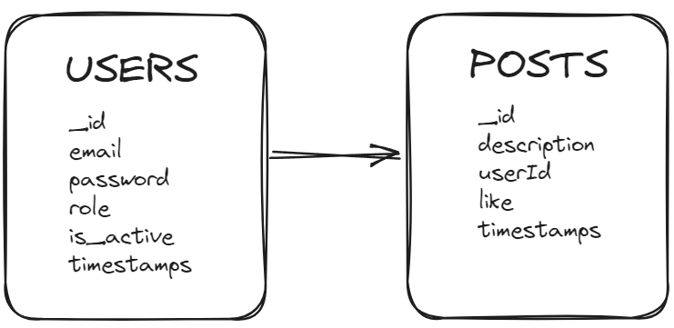

# Backend 2 Social Network

Welcome to my SocialNetwork Backend project.
<br><br>

</a>

<details>
  <summary>Table of Contents</summary>
  <ol>
 <li><a href="#description">Description</a></li>
    <li><a href="#objetive">Objetive</a></li>
    <li><a href="#deploy-">Deploy</a></li>
    <li><a href="#stack">Stack</a></li>
    <li><a href="#database-schema">Database Schema</a></li>
    <li><a href="#local-installation">Local installation</a></li>
    <li><a href="#endpoints">Endpoints</a></li>
    <li><a href="#development">Development</a></li>
    <li><a href="#contact">Contact</a></li>
  </ol>
</details>
<br>

## Description
This project consists of creating a social network. The idea is to feed it with users who can register and interact with other users.
It also implements the function of uploading each user's publications, and the rest of the users will be able to interact with them by giving them likes if they are to their liking or interest.


## Objetive
The aim of this project is to put into practice the acquired knowledge of JavaScript, Express, Node and Mongo to develop a social network where users access the network and interact.
At least two collections (users and posts) will be needed.

## Deploy
<div align="center">
   <strong> Click here! </strong></a>
</div>

## Stack
<div align="center">
<a>
    
</a>
<a>
    
</a>
<a>
    
</a>
<a>
    
</a>
<a>

</a>
<a>
    
</a>
<a>
    
</a>
<a>
    
</a>
</div>


## Database Schema



## Local installation
1. Install docker and create a Mongo DB container
``` docker run -d -p 27017:27017 --name mongo -v mongo_data:/data/db -e MONGO_INITDB_ROOT_USERNAME=root -e MONGO_INITDB_ROOT_PASSWORD=root mongo:latest   ```
2. Clone the repository
3.  ``` $ npm install  ```
4. We connect our repository with the database
5. ``` $ npm run dev ``` 
6. ``` $ We run the seeders $ npm run db:seed ``` 


## Endpoints
<details>
<summary>Authentication</summary>

- **Register user**

          POST http://localhost:4000/api/auth/register

    body:

    ```js
        {
            "email": "santi@santi.com",
            "password": "123456789"
        }
    ```

<br>

- **Login user**	

          POST http://localhost:4000/api/auth/login

    body:

    ```js
        {
            "email": "santi@santi.com",
            "password": "123456789"
        }
    ```
</details>
<details>
<summary>Users</summary>

- **View all users** (Is Admin)

          GET http://localhost:4000/api/users

    auth:

    ```js
        auth token
    ```

<br>

- **View user profile**

          GET http://localhost:4000/api/users/profile

    auth:

    ```js
        auth token
    ```

<br>

- **Update user profile**

          PUT http://localhost:4000/api/users/profile

    body:

    ```js
        {
            "email": "silvia@silvia.com",
            "password": "123456789"
        }
    ```

    auth:

    ```js
        auth token
    ```

</details>
<details>
<summary>Posts</summary>

- **Create post** 

          POST http://localhost:4000/api/posts

    body:

    ```js
        {
            "description": "Welcome"
        }
    ```

    auth:

    ```js
        auth token
    ```

<br>

- **Delete post**

          DLETE http://localhost:4000/api/posts/:id

    auth:

    ```js
        auth token
    ```

<br>

- **Update post**

          PUT http://localhost:4000/api/posts/:id

    body:

    ```js
        {
            "description": "Update succesfully"
        }
    ```

    auth:

    ```js
        auth token
    ```

<br>

- **Get own posts**

          GET http://localhost:4000/api/posts/own

    auth:

    ```js
        auth token
    ```

<br>

- **Get all posts**

          GET http://localhost:4000/api/posts

    auth:

    ```js
        auth token
    ```

<br>

- **Get post by id**

          GET http://localhost:4000/api/posts/:id

    auth:

    ```js
        auth token
    ```

<br>

- **Get posts by a user** 

          GET http://localhost:4000/api/posts/users/:id-user

    auth:

    ```js
        auth token
    ```

<br>


- **Like and unlike post**

          PUT http://localhost:4000/api/posts/like/:id


    auth:

    ```js
        auth token
    ```
</details>

## Development

```js
const developer = "Santiago Alfaro";

console.log("Developed by: Santiago Alfaro")
```

## Contact
- **Santiago Alfaro Martí**
  - [GitHub](https://github.com/SantiagoAlfaroMarti)